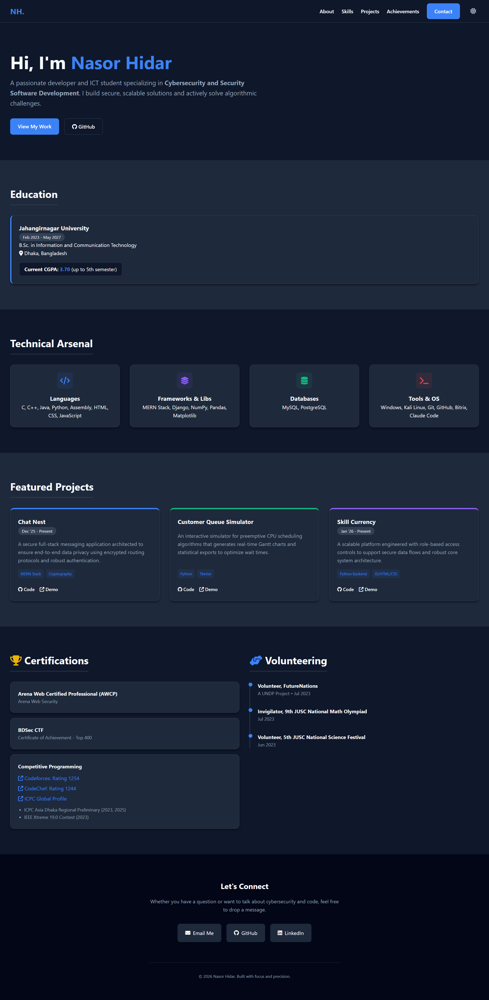

# Nasor Hidar | Software Engineer Portfolio

<div align="center">
  
  
  
</div>
<br/>

A lightweight, fully responsive personal portfolio website showcasing my work in Software Engineering, Cybersecurity, and Competitive Programming. Built entirely from scratch without heavy frameworks to ensure maximum performance and maintainability.

🌍 **Live Demo:** [nasorhidar.com](https://nasorhidar.com)

---

## 📸 Preview



## 🚀 Features

* **Custom Architecture:** Clean, semantic HTML5 paired with modular CSS3 and ES6 JavaScript.
* **Light/Dark Theme:** Built-in theme toggle that automatically detects system preferences and saves user overrides via local storage.
* **Fully Responsive:** Adapts seamlessly to mobile, tablet, and desktop viewports using CSS Flexbox and Grid.
* **Optimized Performance:** Zero external framework dependencies (aside from FontAwesome for typography/icons) for near-instant load times.

## 📂 Project Structure

```text
├── index.html    # The semantic structure and content layout
├── styles.css    # Custom CSS variables, responsive grids, and animations
└── script.js     # Theme-switching logic and DOM manipulation
```

## 💻 Highlighted Work Included

This portfolio actively showcases my core technical projects:

* **Chat Nest:** Secure MERN stack messaging app with encrypted routing.
* **Customer Queue Simulator:** Python/Tkinter CPU scheduling visualization.
* **Skill Currency:** Scalable Python backend platform with role-based access.

## 🛠️ Running Locally

Since this project utilizes pure vanilla web technologies, running it locally requires no build steps, package managers, or local servers:

1. **Clone the repository:**
   ```bash
   git clone [https://github.com/NasorHidar/nasorhidar.com.git](https://github.com/NasorHidar/nasorhidar.com.git)
   ```
2. **Navigate to the directory:**
   ```bash
   cd nasorhidar.com
   ```
3. **Launch the site:**
   Simply double-click `index.html` to open it in your default web browser. Alternatively, use an extension like VS Code Live Server for hot-reloading while making edits.

## 📬 Connect With Me

* **Email:** [nasorhidar@gmail.com](mailto:nasorhidar@gmail.com)
* **LinkedIn:** [in/nasor-hidar](https://www.linkedin.com/in/nasor-hidar/)
* **Codeforces:** [Undefined_Code](https://codeforces.com/profile/Undefined_Code)
* **CodeChef:** [undefined_code](https://www.codechef.com/users/undefined_code)

---
<div align="center">
  <i>Built with focus and precision.</i>
</div>
